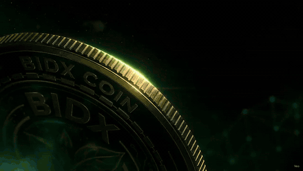

<div align="center">
  
  <h1>BIDX Coin — Website</h1>
  <p><strong>A scroll-driven film about a blockchain rooted in real impact.</strong></p>
  <p>
    <a href="https://bidx-coin-website.vercel.app"></a>
  </p>
  <p>
    
    
    
    
    
  </p>
</div>

<br>

<table>
<tr>
<td width="46%" valign="top">
  <a href="https://bidx-coin-website.vercel.app" title="Open the live site">
    
  </a>
  <p align="center">
    <sub><a href="https://bidx-coin-website.vercel.app"><b>▶ Open the live site</b></a> · <a href="docs/preview.mp4">full-quality MP4</a></sub>
  </p>
</td>
<td width="54%" valign="top">

<h3>What this is</h3>

<p>The public-facing site for <b>BIDX</b> — a <i>proposed</i> BNB Smart Chain eco-finance
concept that connects on-chain participation with traceable tree planting.</p>

<p>The page is built as a single continuous film. A hero clip reveals the coin, then
six scroll-scrubbed chapters carry you from an on-chain signal down into soil,
outward across a plantation network, and up to a public evidence trail.</p>

<h3>Highlights</h3>

<ul>
  <li><b>Scroll-scrubbed video chapters</b> — video timelines bound to scroll position, cross-dissolved at the seams</li>
  <li><b>Interactive eco-ledger</b> — trace a sample contribution from transaction to survival check</li>
  <li><b>3.6 MB initial load</b> — down from ~101 MB of eagerly-fetched video</li>
  <li><b>Light &amp; dark themes</b>, full <code>prefers-reduced-motion</code> support, responsive to 375px</li>
</ul>

<p>
  <a href="https://bidx-coin-website.vercel.app"><b>Live site&nbsp;↗</b></a> &nbsp;·&nbsp;
  <a href="BIDX_COIN_BUSINESS_PLAN.md"><b>Business plan&nbsp;↗</b></a>
</p>

</td>
</tr>
</table>

> [!IMPORTANT]
> **This is a planning concept, not a live financial product.** The site is not an
> offer to sell tokens or securities. Token figures, the USD 1 reference price, the
> 24-month staking design and all plantation and carbon statements remain subject to
> legal, economic, security and environmental verification. Records shown in the
> eco-ledger are illustrative samples, not live chain data.

---

## Interactive eco-ledger

The centrepiece interaction. Rather than *asserting* traceability, it lets a visitor
operate it — pick a sample contribution and walk its trail:

```
Contribution recorded  →  Allocation restricted  →  Campaign approved
        →  Evidence published  →  Survival rechecked (3 / 6 / 12 / 24 mo)
```

Three sample records sit at deliberately different stages of maturity — one closed
24-month cycle, one mid-flight, one still awaiting its first check — so the trail
shows `Pending` and `Scheduled` states rather than a wall of green ticks. Every stage
expands to its own metadata (block, allocation share, species mix, coordinates), and
each survival checkpoint is clickable.

Source: [`src/components/EcoLedger.tsx`](src/components/EcoLedger.tsx)

## The scroll engine

[`CinematicWorld.tsx`](src/components/CinematicWorld.tsx) drives the six journey
chapters. Each chapter owns a video whose `currentTime` is bound to scroll progress
rather than played, so the visitor scrubs the footage directly.

Three details make it hold up:

- **Smoothed seeking.** Raw scroll deltas are lerped toward a target time
  (`+= (desired - current) * 0.16`) so fast flicks don't jerk the frame.
- **Eased cross-dissolves.** Chapters overlap for a configurable slice of their scroll
  band (`fadeLead`) with a smoothstep curve. Where two clips don't line up — the
  Planting→Scale seam shifts a large foreground coin — that seam gets a shorter lead so
  the coin doesn't ghost as a double image.
- **Demand-driven loading.** Only the active chapter and the next one are fetched.

Clips are encoded with a dense GOP (keyframe every 12 frames) so a scroll seek always
lands near a keyframe; the autoplayed hero clip is *played* rather than seeked, so it
keeps a normal GOP and compresses far smaller.

## Performance

The media pipeline was the whole ballgame. Every asset the code actually references
was re-encoded, and the unreferenced ones were dropped from the bundle:

| Asset | Before | After | |
|---|---:|---:|---|
| 9 posters | 53.5 MB PNG | **2.4 MB** WebP | −96% |
| 7 videos | ~101 MB @ 1080p | **15.7 MB** @ 720p | −84% |
| Logo (rendered at 38px) | 1.23 MB | **20 KB** | −98% |
| Unreferenced media | ~87 MB shipped | **0** | — |
| **Initial page load** | ~101 MB before scroll worked | **3.6 MB** | — |

Two loader bugs fixed along the way:

- All six chapter clips were fetched **on mount, serially**. The comment claimed
  "load nearby clips first," but `.sort((a, b) => a - b)` on an already-ascending
  array is a no-op. Loading is now driven by the active chapter.
- Two clips downloaded **twice** — `<video preload="auto">` pulled the raw file while
  the blob fetch pulled it again. Dropped to `preload="metadata"`.

Production bundle: **398 KB JS** (124 KB gzipped) · **24.6 KB CSS** (6.3 KB gzipped).

## Getting started

Requires **Node 20+** (developed on Node 24.18 / npm 11.16).

```bash
git clone https://github.com/rehantariq121/BIDX-COIN-WEBSITE.git
cd BIDX-COIN-WEBSITE
npm install
npm run dev
```

Then open **http://localhost:5173**.

| Script | Purpose |
|---|---|
| `npm run dev` | Vite dev server with HMR on port 5173 |
| `npm run build` | Typecheck (`tsc -b`) then build to `dist/` |
| `npm run preview` | Serve the production build locally |

## Media pipeline

Web-sized assets in `public/` are generated, not hand-made. Originals live in
`media-source/` (gitignored — too large to ship) and the encoder is reproducible:

```bash
bash scripts/optimize-media.sh
```

It converts posters to WebP, re-encodes the scrubbed clips at 720p with a dense GOP,
encodes the autoplay hero separately, resizes the logo, and retires anything the
source no longer references. Requires `ffmpeg` with `libwebp` and `libx264`.

> Re-running is safe: originals are stashed on first run, and later runs read from
> the stash rather than re-compressing already-compressed output.

## Project structure

```
src/
├── App.tsx                      page composition, chapter + copy data
├── styles.css                   design tokens, light/dark themes, all component CSS
└── components/
    ├── HeroFilm.tsx             autoplaying coin reveal
    ├── CinematicWorld.tsx       scroll-scrubbed chapter engine
    └── EcoLedger.tsx            interactive traceability explorer
public/
├── posters/  *.webp             chapter stills + video posters
├── videos/   *.mp4              720p, dense-GOP for scrubbing
└── logo/                        mark + favicon
scripts/optimize-media.sh        reproducible media encoder
docs/                            README preview assets
```

Styling is plain CSS with custom properties — no framework. Themes derive from
`prefers-color-scheme`, and every animation is guarded behind `useReducedMotion()`.

## Deployment

Deployed on Vercel. Vite is auto-detected, so no config is needed:

```bash
npx vercel deploy --prod
```

## Licence

No licence has been declared. All rights reserved by the project owner.

---

<div align="center">
  <sub>Planning concept only · Not an offer to sell tokens or financial products<br>
  All launch claims remain subject to legal, economic, security and environmental verification</sub>
</div>
